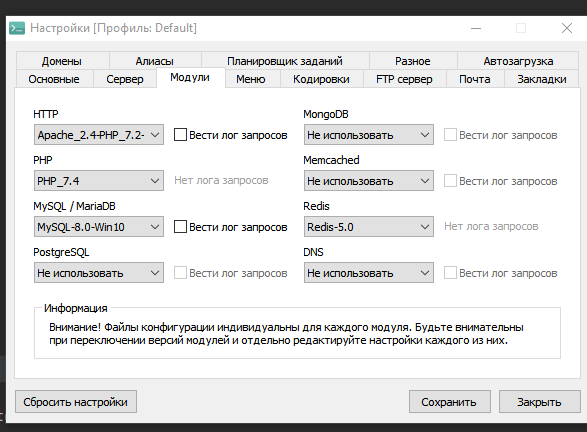
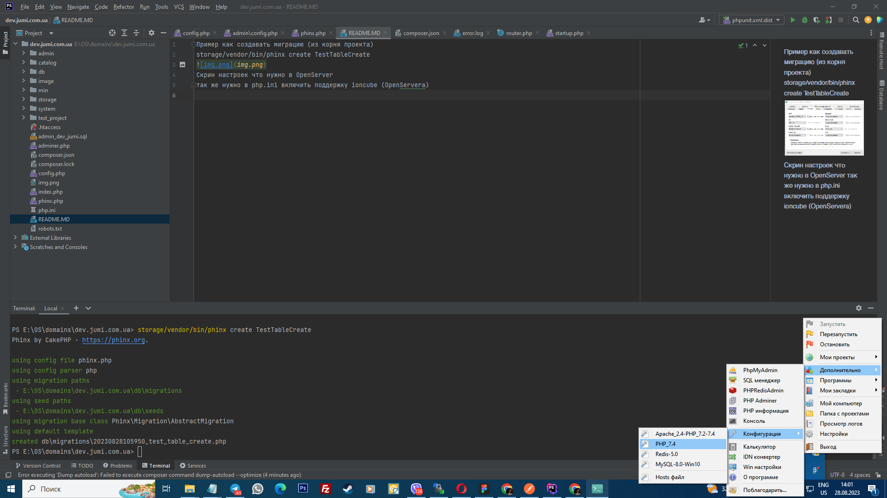
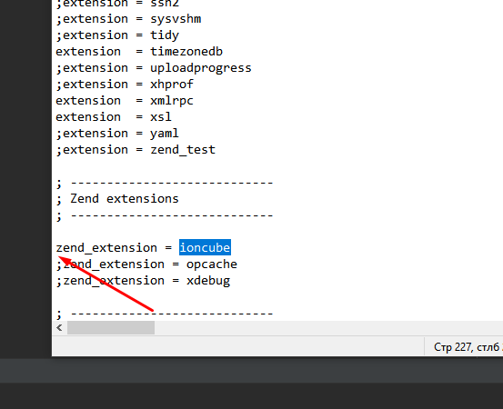
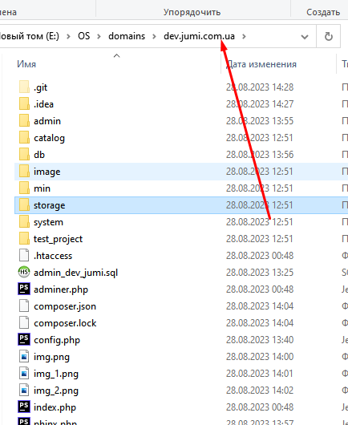
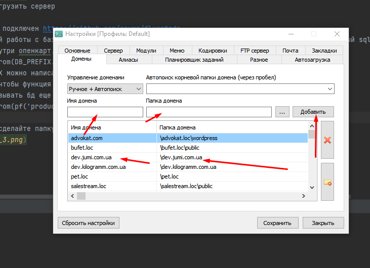

После того как установите проект, обновите модификаторы в админ панели сайта.
Так же важно  прописать   в config.php в переменной document_root свой путь, 
и после добавьте в .gitignore config.php и папку system/storage/modification
Пример как создавать миграцию (из корня проекта)
storage/vendor/bin/phinx create TestTableCreate 

Скрин настроек что нужно в OpenServer
так же нужно в php.ini включить поддержку ioncube (OpenServera)

Тут нужно убрать ";" 

сохранить и перегрузить сервер

Так же к проекту подключен https://github.com/envms/fluentpdo
для более простой работы с базой данных (описывать запросы в модели), вы вольны использовать как обычный sql так и fluent. 
Пример вызова внутри опенкарт.
$this->fluent->from(DB_PREFIX.'product')->select('product_id')->fetchAll();
Там где DB_PREFIX можно написать helper по типу
pf('product') и чтобы функция возвращала с prefixом название таблицы, я его добавил
Поэтому можно вызывать бд еще и так
$this->fluent->from(pf('product'))->select('product_id')->fetchAll();

В папке domains сделайте папку именно dev.jumi.com.ua

И вот так добавьте домен

